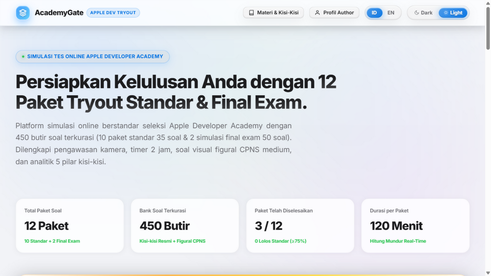
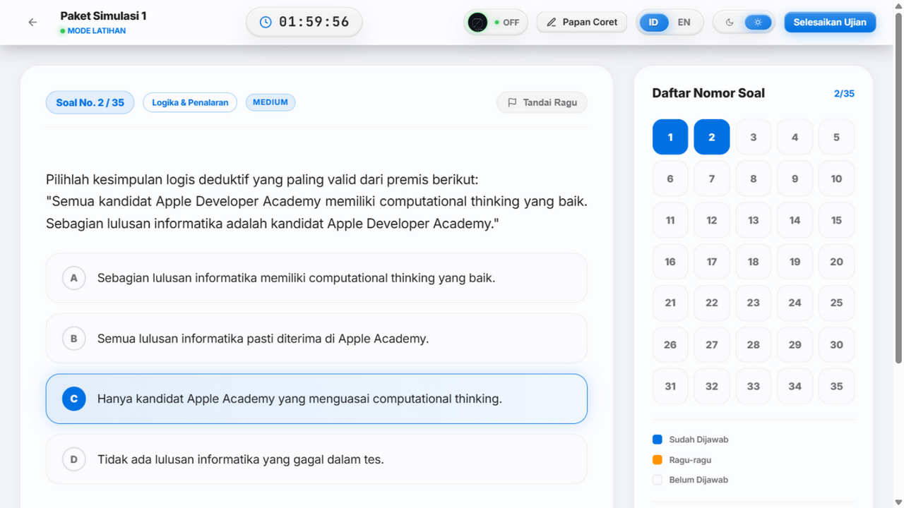
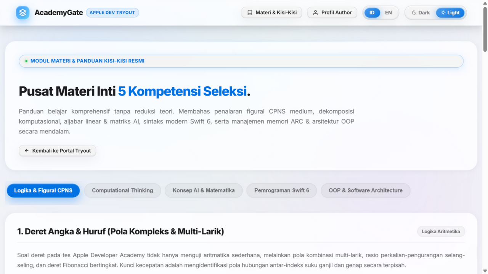

# 🍎 AcademyGate — Apple Developer Academy Online Test Simulator

<div align="center">


<p align="center">
  <b>Platform Simulator Tryout Ujian Seleksi Online Resmi Apple Developer Academy (Indonesia Cohort)</b><br>
  Dirancang dengan estetika ultra-premium <i>visionOS Liquid Glassmorphism</i>, bebas AI-slop, dan terstandarisasi 100% mengikuti kisi-kisi resmi.
</p>

</div>

---

## 🌟 Fitur Utama

- 💎 **Estetika visionOS Liquid Glassmorphism:** Antarmuka responsif tanpa *AI slop*, efek sliding liquid pill pada switcher tema (Dark/Light) dan dwibahasa (ID/EN), transisi ultra-halus, dan tata letak terjustifikasi (*justified text*).
- 🏆 **12 Paket Ujian Terstandarisasi:**
  - **10 Paket Latihan Standar (35 Butir Soal • 120 Menit)**: Evaluasi proporsional menyeluruh untuk latihan rutin.
  - **2 Paket Simulasi Final Exam (50 Butir Soal • 120 Menit)**: Paket 11 & 12 dengan bobot soal seleksi nyata untuk menguji ketahanan berpikir komputasi dan ketepatan waktu.
- 📐 **Soal Gambar Pola Figural CPNS Medium & Opsi Bergambar (SVG Interaktif):**
  - Pola rotasi geometri bertahap ($45^\circ / 90^\circ / 135^\circ$).
  - Seri figural matriks $3 \times 3$ berlandaskan operasi logika boolean (XOR/AND/OR).
  - Analogi bangun spasial $A : B = C : D$.
  - Jaring-jaring kubus 3D dengan deteksi sisi berhadapan.
  - **Opsi jawaban bergambar (A, B, C, D) berbasis SVG murni** tanpa distorsi piksel.
- 📚 **Pusat Materi & Kisi-Kisi Lengkap (Study Materials Hub):**
  - Modul teori komprehensif tanpa reduksi teori mencakup 5 pilar kisi-kisi resmi Apple Developer Academy (dwibahasa ID/EN penuh):
    1. **Logika & Figural CPNS** (Deret multi-larik, silogisme deduktif, kuantor, hukum De Morgan, spasial 3D, analogi figural A:B=C:D).
    2. **Computational Thinking** (4 Pilar CT, penelusuran state variabel, Big-O complexity, struktur data, BFS/DFS, memoization, rekursi & call stack).
    3. **Konsep AI & Matematika** (Perkalian matriks, determinan, invers, dot product vektor, cosine similarity, ReLU/Sigmoid, softmax & gradient descent).
    4. **Pemrograman Swift 6 Modern** (Immutability let/var, optionals if let vs guard let, higher-order functions map/filter/reduce, closures, inout & defer, access control, property observer, generics).
    5. **OOP & Software Architecture** (Struct Stack value types vs Class Heap reference types, Protocol-Oriented Programming, ARC weak/unowned references & pencegahan retain cycle memory leaks, delegation/singleton/SOLID, concurrency modern async/await & actor).
- 📝 **Papan Coretan & Scratchpad Teks Real-Time:** Dilengkapi kanvas gambar interaktif (Pena warna, penghapus, pembersih kanvas) dan editor catatan teks tersinkronisasi otomatis saat ujian berlangsung.
- 📊 **Dashboard Evaluasi & Radar Chart Interaktif:** Analisis mendalam kekuatan per pilar kisi-kisi, evaluasi kelulusan standar $\ge 75\%$, review komprehensif kunci jawaban dan pembahasan rinci, serta filter status soal (*Benar, Salah, Ragu-ragu*).
- 👤 **Halaman Profil Author:** Menampilkan profil, portfolio proyek iOS/Web, dan keahlian developer.

---

## 📸 Cuplikan Tampilan

| Portal Beranda | Ruang Ujian | Pusat Materi (Tema Terang) |
|---|---|---|
|  |  |  |

---

## 🔒 Arsitektur Keamanan Bank Soal (Anti DevTools Leak)

Proyek ini dirancang agar **kunci jawaban tidak pernah bocor** ke sisi browser — termasuk melalui DevTools (F12) pada tab Network maupun Sources:

1. **Penilaian 100% Server-Side:** Endpoint `GET /api/package/<id>` *selalu* menghapus field `correct_answer`, `explanation_id`, dan `explanation_en` dari respons — pada mode `exam` **maupun** `practice`. Pembahasan hanya dikirim sebagai bagian dari respons `POST /api/submit` setelah jawaban dikirim.
2. **File Dataset Tidak Ter-Expose:** Direktori `data/packages/*.json` tidak pernah di-serve sebagai aset statis; akses langsung dan path traversal (`../`) ditolak 404 oleh `send_from_directory` Flask.
3. **Build Minifikasi Release:** `python build_release.py` meminimalkan seluruh JS/CSS ke `static/dist/` (komentar, whitespace, dan formatting pembangun dihapus) sehingga bundle client sulit dibaca secara kasual di tab Sources.
4. **Catatan Jujur:** JavaScript sisi client pada dasarnya selalu dapat dilihat oleh pengguna yang bersungguh-sungguh (berlaku untuk semua aplikasi web). Perlindungan riil proyek ini bersifat **arsitektural** (poin 1–2): kunci jawaban tidak pernah berada di client, sehingga tidak ada yang bisa "dicuri" dari DevTools.

Setelah mengubah sumber `static/js` atau `static/css`, jalankan ulang `build_release.py` agar file `.min` dan cache-buster di `templates/index.html` ikut ter-update.

---

## 🧭 Struktur Kisi-Kisi Soal (5 Pilar Kompetensi)

| No | Kompetensi Kisi-Kisi | Porsi Standar (35 Soal) | Porsi Final Exam (50 Soal) | Pokok Bahasan Utama |
|---|---|---|---|---|
| 1 | **Logika & Figural CPNS** | 10 Soal (28.5%) | 15 Soal (30.0%) | Deret angka/huruf, silogisme, rotasi geometris, analogi figural, jaring kubus 3D, penataan posisi. |
| 2 | **Computational Thinking** | 8 Soal (22.8%) | 12 Soal (24.0%) | Dekomposisi modular, abstraksi data, penelusuran algoritma (dry run), Big-O, BFS/DFS, rekursi. |
| 3 | **Konsep AI & Matematika** | 6 Soal (17.1%) | 8 Soal (16.0%) | Perkalian matriks, determinan, invers, dot product vektor, cosine similarity, supervised learning, ReLU. |
| 4 | **Pemrograman Swift 6** | 6 Soal (17.1%) | 8 Soal (16.0%) | Let vs var, optionals unwrapping, closures, higher-order functions (map/filter/reduce), tebak output kode. |
| 5 | **OOP & Architecture** | 5 Soal (14.5%) | 7 Soal (14.0%) | Struct vs Class, Protocol-Oriented Programming (POP), ARC weak/unowned, delegate pattern, retain cycles. |

---

## 🚀 Panduan Instalasi & Menjalankan Aplikasi

### 1. Prasyarat
- **Python 3.9+** terpasang di sistem operasi Anda.
- Web browser modern (Safari, Chrome, Edge, atau Firefox).

### 2. Kloning Repositori
```bash
git clone https://github.com/username/AppleDevelopExamTest.git
cd AppleDevelopExamTest
```

### 3. Instal Dependensi
```bash
pip install flask
```

### 4. Menjalankan Server
```bash
python app.py
```
Aplikasi akan berjalan secara lokal di:
```text
http://localhost:5000/
```

### 5. (Opsional) Build Ulang Paket Soal
Jika ingin mengacak atau menghasilkan ulang dataset 12 paket soal JSON:
```bash
python generate_questions.py
```

### 6. (Opsional) Build Aset Produksi
Menghasilkan ulang bundle minifikasi JS/CSS di `static/dist/` (dipakai oleh `templates/index.html`):
```bash
pip install rjsmin rcssmin
python build_release.py
```
> Jalankan langkah ini setiap kali Anda mengubah file di `static/js/` atau `static/css/`.

### 7. Deployment (GitHub + Vercel)

Proyek ini dikonfigurasi siap-deploy ke Vercel sebagai serverless Flask:

```bash
# 1. Push ke GitHub (repo: kiki1515/tryacademygate)
git push origin main

# 2. Deploy ke produksi Vercel (butuh Vercel CLI ter-login)
vercel deploy --prod --name tryacademygate
```

**URL Produksi:** <https://tryacademygate.vercel.app>

Catatan arsitektur serverless:
- `app.py` otomatis mendeteksi environment Vercel (`VERCEL=1`) dan mengarahkan penyimpanan riwayat ke `/tmp` (satu-satunya direktori writable). Riwayat bersifat **ephemeral** — ter-reset saat cold start. Untuk persistensi penuh, hubungkan database cloud (mis. Supabase/Upstash).
- Kunci jawaban tetap tidak pernah dikirim ke client di mode apa pun — penilaian 100% server-side.
- Setelah mengubah aset (`static/js`, `static/css`), jalankan `python build_release.py` sebelum commit agar bundle `.min` ikut ter-update.

---

## 📁 Struktur Direktori Proyek

```text
AppleDevelopExamTest/
├── app.py                     # Flask server backend & REST API endpoints
├── build_release.py           # Build script minifikasi JS/CSS -> static/dist/
├── generate_questions.py      # Generator otomatis dataset 12 paket soal & SVG visual
├── LICENSE                    # Lisensi MIT
├── README.md                  # Dokumentasi lengkap proyek
├── screenshots/               # Cuplikan tampilan (portal, ruang ujian, materi)
├── data/
│   ├── packages_index.json    # Metadata ringkasan 12 paket ujian
│   ├── history.json           # Riwayat submission hasil tryout lokal
│   └── packages/              # Dataset detail 12 paket soal (JSON)
│       ├── package_1.json ... package_10.json  # 10 Paket Standar (35 Qs)
│       ├── package_11.json                     # Final Exam Paket A (50 Qs)
│       └── package_12.json                     # Final Exam Paket B (50 Qs)
├── templates/
│   └── index.html             # Template HTML SPA utama (memuat aset .min)
└── static/
    ├── assets/                # Aset gambar & profil author
    │   └── author.png
    ├── css/                   # Sumber CSS (development, ter-format)
    ├── js/                    # Sumber JS (development, ter-komentar)
    └── dist/                  # Output build minifikasi (dipakai produksi)
        ├── css/*.min.css
        └── js/*.min.js
```

---

## 🛠️ REST API Endpoints

- `GET /api/packages` : Mengambil daftar seluruh paket tryout dan metadata status pengerjaan.
- `GET /api/package/<id>?mode=exam|practice` : Mengambil detail paket butir soal (pada mode exam, kunci jawaban disembunyikan untuk mencegah kecurangan).
- `POST /api/submit` : Mengirim jawaban ujian untuk penilaian otomatis, perhitungan akurasi per kategori, radar score, dan penyimpanan riwayat evaluasi.
- `GET /api/history` : Mengambil riwayat skor ujian sebelumnya.
- `POST /api/history/clear` : Mereset data riwayat pengerjaan lokal.

---

## 👨‍💻 Author & Pengembang

Dikembangkan oleh: **Muhammad Fikri Khrisna**
- Profil lengkap dan portofolio proyek dapat dilihat langsung melalui menu navigasi **"Author"** di dalam aplikasi.

---

## 📄 Lisensi

Proyek ini dirilis di bawah lisensi [MIT License](LICENSE).
